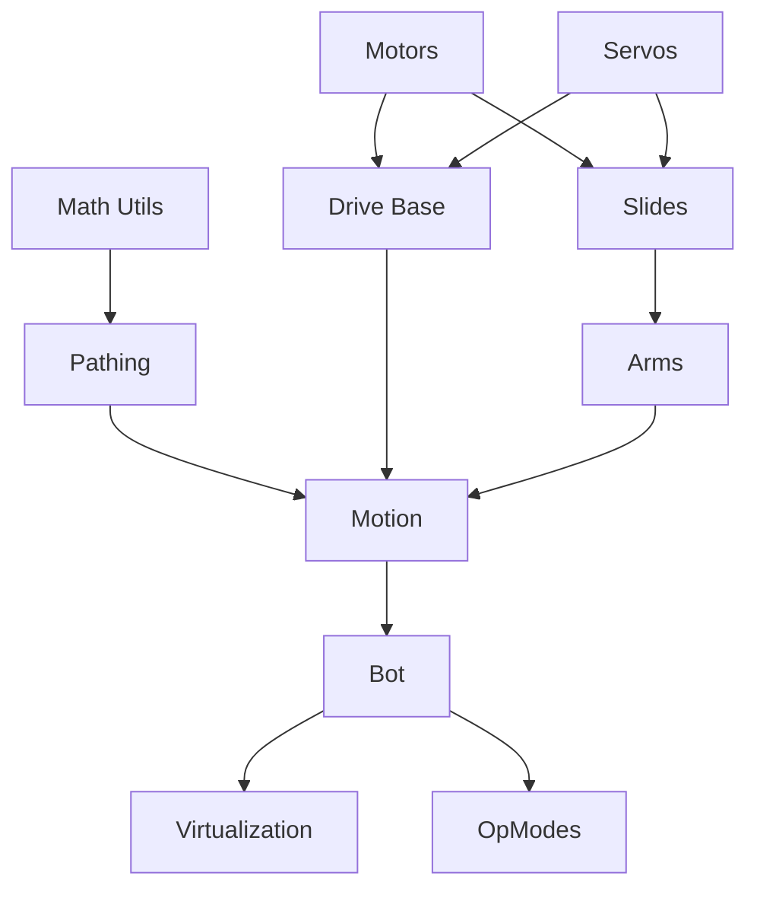

# KURCIVE
_Pronounced "Cursive"_

> [!Warning]
> Currently Under Development

## Modular Design

```mermaid
graph TD
    MathUtils[Math Utils]
    Motors[Motors]
    Servos[Servos]

    Pathing[Pathing]
    Base[Drive Base]
    Slides[Slides]

    Arms[Arms]
    Motion[Motion]
    Bot[Bot]
    Virtualization[Virtualization]
    OpModes[OpModes]

    MathUtils --> Pathing
    Pathing --> Motion

    Motors --> Base
    Motors --> Slides
    Servos --> Base
    Servos --> Slides

    Base --> Motion
    Slides --> Arms
    Arms --> Motion

    Motion --> Bot
    Bot --> Virtualization
    Bot --> OpModes
```
