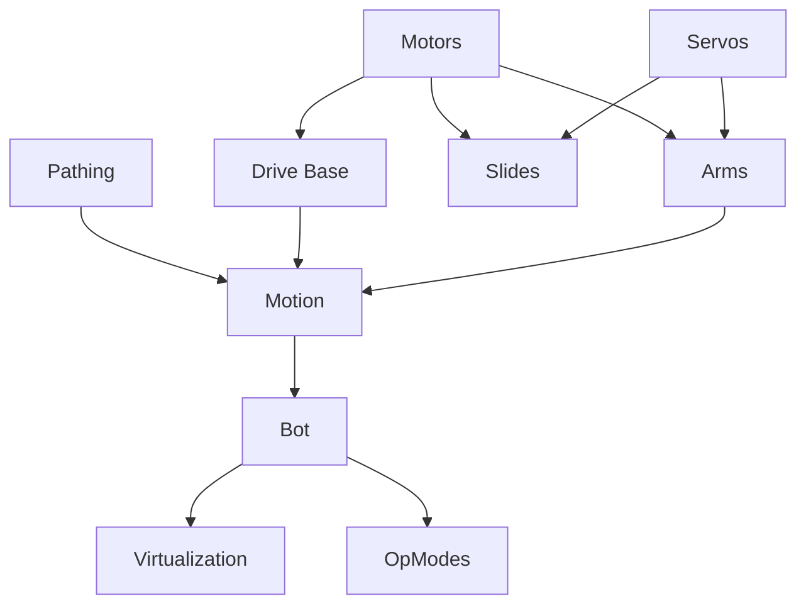

# KURCIVE
_Pronounced "Cursive"_

> [!Warning]
> Currently Under Development

## Modular Design

The following diagram presents a simplified system architecture overview, emphasizing core modular components and their data/control flow relationships.

